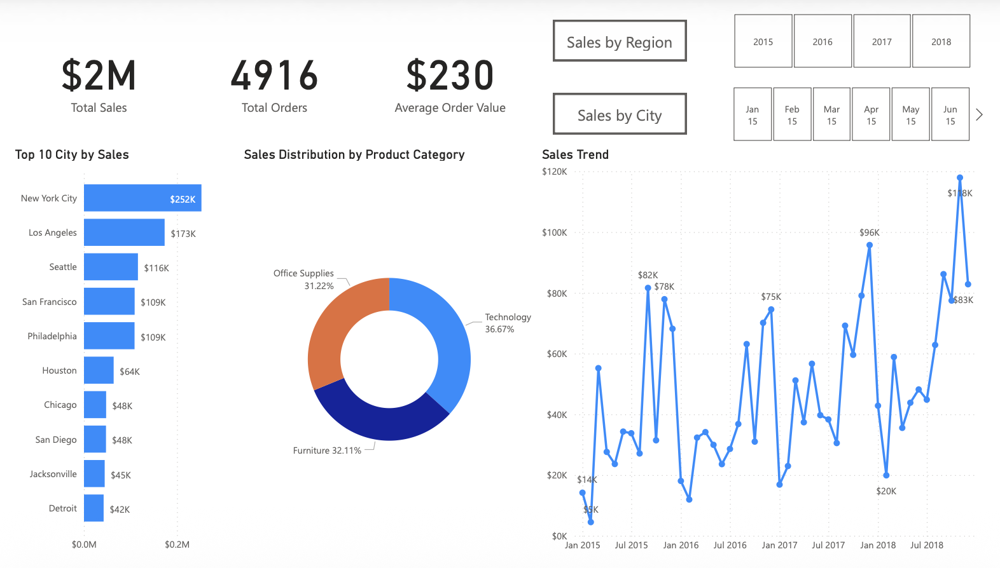
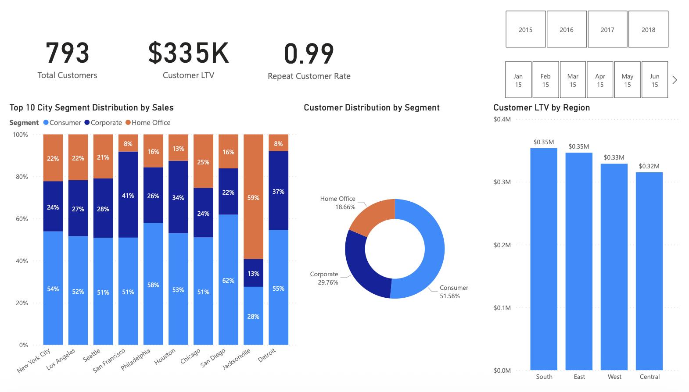
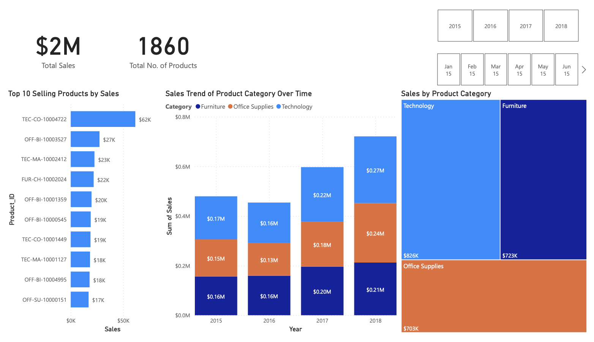

# Superstore Sales Analysis Project

## 📊 Project Overview

This project provides a comprehensive analysis of a superstore's sales data using multiple analytical approaches including **SQL analysis**, **Python data analysis**, and **Power BI visualization**. The project analyzes retail sales data from a fictional superstore to extract meaningful business insights and patterns.

## 🎯 Project Objectives

The main objectives of this analysis are to:

- Understand sales performance across different dimensions (time, geography, products, customers)
- Identify top-performing customers, products, and regions
- Analyze shipping patterns and delivery efficiency
- Discover trends in order patterns and customer behavior
- Provide actionable business insights for decision-making

### Power BI Dashboard

<!-- Insert Power BI dashboard screenshots here -->







## 📁 Project Structure

```
├── README.md                                      # Project documentation
├── superstore_final_dataset.csv                   # Main dataset (9,800+ records)
├── superstore_sales_cleaned.csv                   # Cleaned version of the dataset
├── SuperstoreData_cleaned_dump_Dataset.sql        # SQL database dump file
├── Superstore_sales_analysis_SQL_Insights.sql     # SQL queries for business insights
├── SuperstoreSalesAnalysis_JupyterNotebook.ipynb  # Python analysis notebook
├── Superstore Sales Insights.pbix                 # Power BI dashboard file
└── Superstore Sales Insights.pdf                  # Power BI report export (3 pages)
```

## 📈 Dataset Information

**Dataset Size**: 9,800 records  
**Time Period**: 2015-2018  
**Geographic Coverage**: United States (multiple states, cities, regions)

### Key Columns:

- **Order Information**: Order_ID, Order_Date, Ship_Date, Ship_Mode
- **Customer Details**: Customer_ID, Customer_Name, Segment
- **Geographic Data**: Country, City, State, Postal_Code, Region
- **Product Information**: Product_ID, Category, Sub_Category, Product_Name
- **Financial Data**: Sales

### Product Categories:

- **Furniture**: Bookcases, Chairs, Tables, Furnishings
- **Office Supplies**: Binders, Paper, Storage, Art, Labels, Fasteners, Envelopes, Appliances
- **Technology**: Phones, Accessories

### Customer Segments:

- Consumer
- Corporate
- Home Office

### Geographic Regions:

- West
- East
- Central
- South

## 🔍 Analysis Components

### 1. SQL Analysis (14 Business Questions)

The SQL analysis covers 14 comprehensive business questions including:

1. **Q1**: Percentage of orders shipped on the same date
2. **Q2**: Top 3 customers with highest total order value
3. **Q3**: Top 5 items with highest average sales per day
4. **Q4**: Average order value ranking by customer
5. **Q5**: Highest and lowest orders by city
6. **Q6**: Most demanded sub-category in West region
7. **Q7**: Order with highest number of items
8. **Q8**: Order with highest cumulative value
9. **Q9**: Segment preference for first-class shipping
10. **Q10**: Least contributing city to total revenue
11. **Q11**: Average shipping time analysis
12. **Q12**: Segment with highest orders by state
13. **Q13**: Customers with 3 consecutive days of orders
14. **Q14**: Maximum consecutive days of rising sales

### 2. Python Data Analysis

The Jupyter notebook includes:

- **Data Preprocessing**: Data cleaning, type conversion, duplicate removal
- **Exploratory Data Analysis**: Statistical summaries, data profiling
- **Data Visualization**: Charts and graphs using matplotlib and seaborn
- **Missing Value Treatment**: Handling null values in postal codes
- **Data Quality Checks**: Duplicate detection and removal

### 3. Power BI Dashboard

- Interactive visualizations and dashboards
- 3-page comprehensive report
- Business intelligence insights
- Visual analytics for stakeholder presentation

## 🛠️ Technologies Used

- **SQL**: Database querying and analysis
- **Python**: Data analysis and visualization
  - pandas (data manipulation)
  - numpy (numerical operations)
  - matplotlib (plotting)
  - seaborn (statistical visualization)
- **Power BI**: Business intelligence and dashboard creation
- **Jupyter Notebook**: Interactive analysis environment

## 📊 Key Insights Categories

The analysis provides insights into:

1. **Sales Performance**

   - Revenue trends over time
   - Top-performing products and categories
   - Regional sales distribution

2. **Customer Analysis**

   - Customer segmentation performance
   - High-value customer identification
   - Purchase behavior patterns

3. **Operational Efficiency**

   - Shipping performance metrics
   - Order fulfillment analysis
   - Delivery time optimization

4. **Geographic Analysis**

   - Regional performance comparison
   - State and city-level insights
   - Market penetration analysis

5. **Product Performance**
   - Category and sub-category analysis
   - Product demand patterns
   - Inventory insights

## 🚀 Getting Started

### Prerequisites

- SQL database system (MySQL recommended)
- Python 3.x with required libraries
- Power BI Desktop (for .pbix file)
- Jupyter Notebook environment

### Setup Instructions

1. **Database Setup**:

   ```sql
   # Import the SQL dump file to create the database
   mysql -u username -p < SuperstoreData_cleaned_dump_Dataset.sql
   ```

2. **Python Environment**:

   ```bash
   pip install pandas numpy matplotlib seaborn jupyter
   ```

3. **Run Analysis**:
   - Execute SQL queries from `Superstore_sales_analysis_SQL_Insights.sql`
   - Open and run `SuperstoreSalesAnalysis_JupyterNotebook.ipynb`
   - Open `Superstore Sales Insights.pbix` in Power BI Desktop

## 📋 Usage

1. **SQL Analysis**: Run individual queries or the complete script against the superstore database
2. **Python Analysis**: Execute the Jupyter notebook cells sequentially for complete data analysis
3. **Power BI**: Open the .pbix file to explore interactive dashboards and visualizations

## 🎯 Business Value

This analysis provides valuable insights for:

- **Inventory Management**: Understanding product demand patterns
- **Customer Relationship Management**: Identifying high-value customers
- **Operations Optimization**: Improving shipping and delivery processes
- **Strategic Planning**: Regional expansion and market focus decisions
- **Revenue Optimization**: Product and customer segment prioritization

## 📄 Output Files

- **SQL Results**: Business question answers and metrics
- **Python Visualizations**: Charts, graphs, and statistical summaries
- **Power BI Report**: Professional dashboard for stakeholder presentation

---

_This project demonstrates end-to-end data analysis capabilities using multiple tools and technologies to extract actionable business insights from retail sales data._
